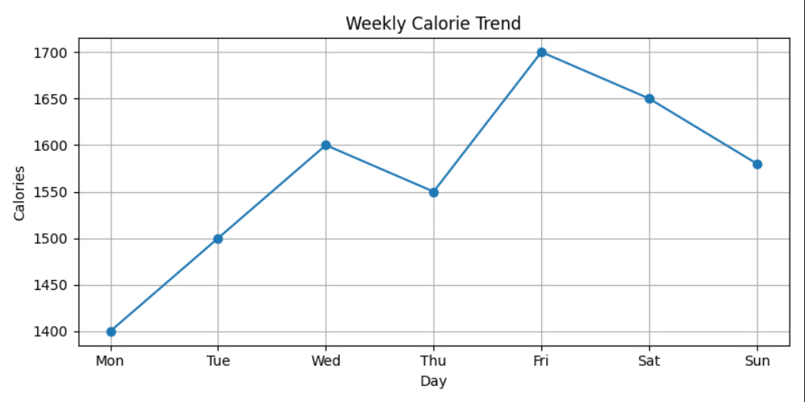
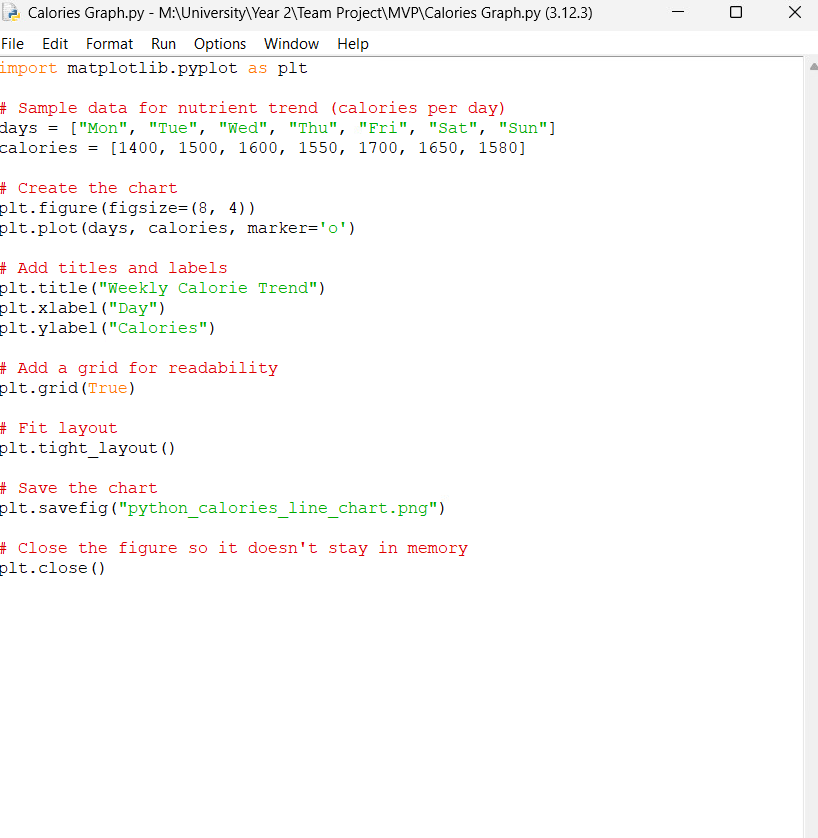

# Product Management Log
 
## Project management discussion
The team has worked really well with all the members agreeing to the effective communication between each other within the group. The project is progressing extremely good and is on track. The work load has been high for some people as some of the team members didn't contributed that good, yet the team discussions didn't stopped and we did reached our goals.

Our weekly lab meetings have really been useful atleast for us who were always consistently present there in the labs all time and the one's who were not struggle did struggled to do out the project. These sessions allowed us to stay organised and progress steadily and very smoothly together. Holding the short meetings after the lab sessions and staying in consistent contacts over the social media helped us to keep everything on time.

## Sprint Burndown Charts

1. Sprint 1

2. Sprint 2 

3. Sprint 3

## Burndown-Charts Discussion

Across all the three sprints, although the team has put amazing efforts together and completed the planned task, but the progress recorded was not consistent in the Tuleap making it a bit difficut to get the track of the momentum throughout each of the sprints. Ideally, improving in making updates to the remaining efforts on a regular basis, will give a clear picture of the mid-sprint progress and track the team's efforts of being behind or ahead. So, from all of the future sprints, the team can do much more better by using retrospective insights, ensuring perfect and proper task distribution among each one of us, use planning poker to get align to the complexity and the capability can better help each one in the group to maintain in their steady progress. By working in these areas, the team can amend transparency, minimize the workflow obstacles, it would raise more reliability towards the future sprints, and boost more visbility helping us continue building a successful track record of all of our sprint goals.

## **Product Backlog**

These are some of the unique features that's going to be present there in our final product

## Other areas 
### 1. Weekly Calorie Trend Chart

This chart demonstrates the user’s calorie intake across a seven-day period.  
At the MVP stage, the chart uses sample data to demonstrate functionality.  
In the final version of the product, this graph will update automatically based on the meals logged by the user.  
We also plan to extend the date range options so that users can view daily, weekly, or monthly trends.

---

### 2. How the Graph Was Generated

The image above shows the Python script used to generate the weekly calorie trend chart.  
The script uses the `matplotlib` library to plot daily calorie values and save the chart as a PNG file.

